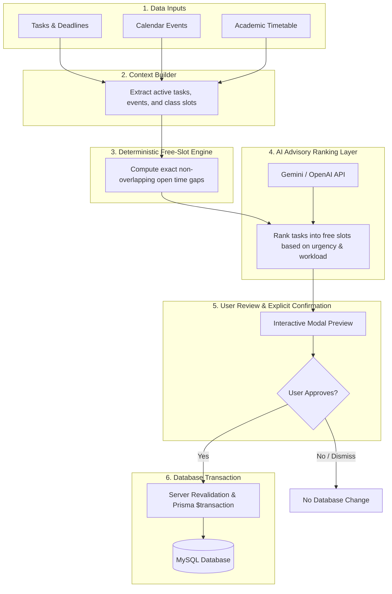

# 🧠 Planora - AI Architectural & Scheduling Design

**Release Identifier**: Planora Core v1.0.0  

Planora adopts a **hybrid AI design architecture** that pairs a **deterministic mathematical free-slot engine** with an **advisory LLM recommendation layer**.

---

## 🎯 Design Rationale: Deterministic Engine vs Pure LLM Generation

Generative Large Language Models (LLMs) excel at natural language understanding and contextual reasoning, but struggle with exact date arithmetic, time boundary constraint math, and zero-hallucination overlap checks.

Relying solely on an LLM to generate calendar schedules introduces severe risks:
- ❌ **Time Overlaps**: LLMs frequently schedule overlapping sessions over existing class timetables.
- ❌ **Hallucinated Dates**: LLMs may generate non-existent calendar dates (e.g. February 30th).
- ❌ **Lack of Guarantees**: Prompt tweaks can unpredictably break calendar boundaries.

### Planora Solution: Hybrid Architecture
To ensure absolute reliability, Planora delegates **all calendar mathematics to a deterministic engine in TypeScript** and uses the **LLM purely for contextual prioritization and human-friendly explanation**.

---

## 🔄 AI Smart Scheduling Workflow

---

## 🔬 Workflow Step-by-Step

1. **Context Extraction**: The backend fetches all pending tasks, scheduled events, and active academic timetable slots for the target date window.
2. **Deterministic Free-Slot Math**: The `freeSlots` algorithm calculates exact start/end timestamps of non-occupied intervals, subtracting existing events, classes, and sleep hours.
3. **AI Task Prioritization & Assignment**: The deterministic free-slot list and task list are passed to the AI provider (`BE/src/modules/ai/ai.provider.ts`). The LLM recommends which high-priority tasks fit into which specific open slots.
4. **Interactive User Review**: The generated schedule is returned to the frontend React UI as a draft recommendation.
5. **Explicit Apply**: The user reviews proposed focus blocks and clicks "Apply Schedule".
6. **Server Revalidation & Atomic Transaction**: The backend re-verifies that no new events were created in the interim and applies all new event sessions inside a single atomic Prisma `$transaction` block.

---

## ✨ Architectural Benefits

| Benefit | Explanation |
| :--- | :--- |
| **100% Conflict Prevention** | Hard calendar boundaries are computed by TypeScript algorithms; overlap is mathematically impossible. |
| **Predictable & Explainable** | Suggestions include natural language rationale explaining *why* a focus session was scheduled at a given time. |
| **Complete User Agency** | AI cannot mutate user data without explicit button confirmation. |
| **Robust Fallback Safe Mode** | If AI service fails or is disabled (`AI_PROVIDER=none`), calendar calculations remain functional and return manual slot options. |
