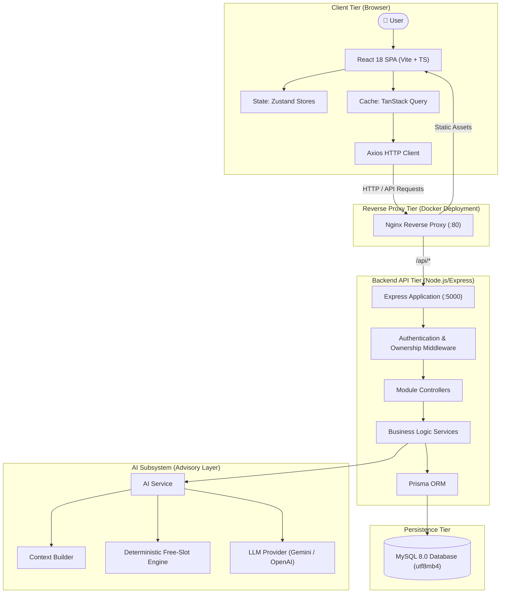

# 🏛️ Planora - System Architecture Document

**Release Identifier**: Planora Core v1.0.0  

Planora is engineered as a decoupled, multi-tier web application consisting of a modern single-page frontend (SPA), a stateless Express REST API, a relational MySQL database managed via Prisma ORM, and an advisory AI scheduling component.

---

## 📐 High-Level Architecture Diagram

---

## 💻 Tech Stack Breakdown

### Frontend Technologies (`FE/`)
- **Core Library**: React 18 with TypeScript.
- **Build Tooling**: Vite 8.3 for fast HMR and optimized production bundling.
- **Styling & UI**: Vanilla CSS + TailwindCSS with custom design system tokens, responsive grid layouts, and Lucide React icons.
- **Routing**: React Router DOM (v6) with single-page application fallback handling.
- **State Management**: 
  - **Zustand**: Client-side ui state, user authentication session, active tab state.
  - **TanStack Query (React Query)**: Asynchronous server state fetching, background refetching, and automatic cache invalidation.
- **Form Management & Validation**: React Hook Form combined with Zod schema validation.
- **HTTP Client**: Axios with interceptors for bearer token injection and error handling.

### Backend Technologies (`BE/`)
- **Runtime & Framework**: Node.js 20 LTS, Express 4, TypeScript.
- **Database & ORM**: MySQL 8.0 (`utf8mb4`), Prisma ORM 5 for typed query construction and schema migrations.
- **Authentication & Security**: JSON Web Tokens (`jsonwebtoken`), `bcryptjs` password hashing, `helmet` HTTP headers, and CORS middleware.
- **Request Validation**: Zod schemas enforcing strict input validation on query params, request bodies, and route parameters.

### Advisory AI Subsystem (`BE/src/modules/ai`)
- **Provider Abstraction Layer**: Support for `none` (safe default mode), `gemini` (Google Gemini API), and `openai`.
- **Context Builder**: Formats tasks, events, and timetable slots into structured prompts.
- **Deterministic Free-Slot Engine**: Calculates available time slots programmatically to prevent calendar conflicts.
- **AI Recommendation Engine**: Prompts LLM to rank and recommend task assignments for open free slots.
- **Explicit User Confirmation**: AI recommendations are strictly advisory and require explicit user confirmation before applying to the database.
