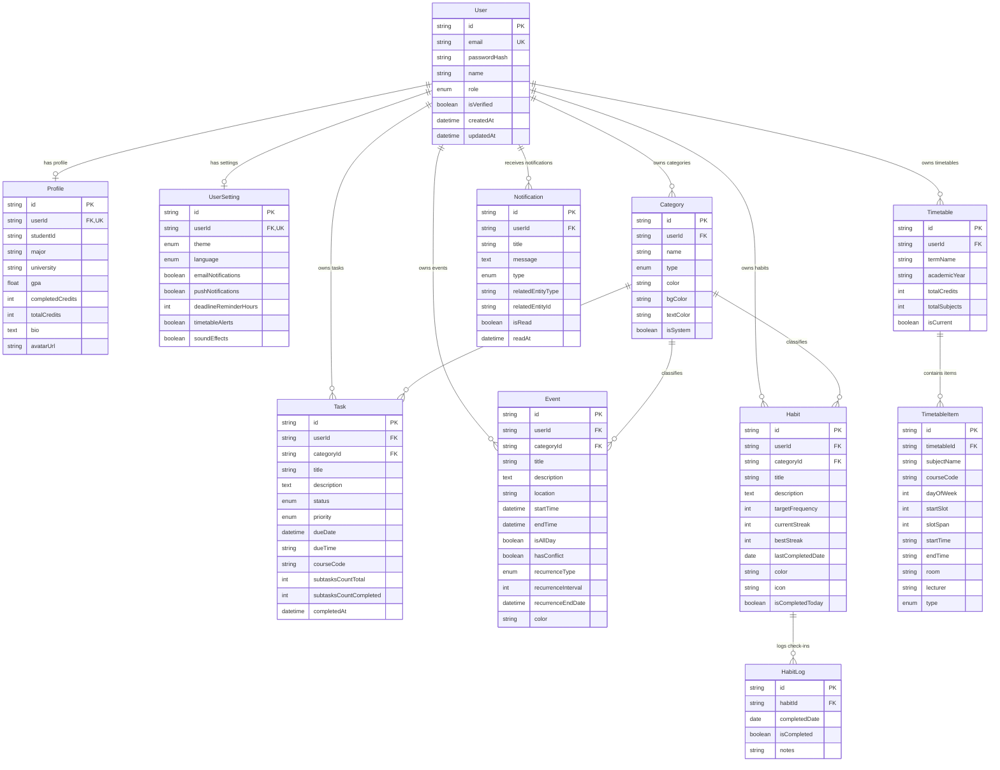

# 🗄️ Planora - Database Documentation

**Release Identifier**: Planora Core v1.0.0  

Planora utilizes MySQL 8.0 with `utf8mb4` encoding managed through Prisma ORM.

---

## 📊 Entity Relationship Diagram (ERD)

---

## 📝 Detailed Model Descriptions

### 1. `User` (`users`)
- **Purpose**: Central authentication and user identity model.
- **Important Fields**: `id`, `email`, `passwordHash`, `name`, `role`, `isVerified`.
- **Relationships**: One-to-one with `Profile` and `UserSetting`; One-to-many with `Category`, `Task`, `Event`, `Timetable`, `Habit`, `Notification`.

### 2. `Profile` (`profiles`)
- **Purpose**: Extended academic and personal details for students/professionals.
- **Important Fields**: `userId`, `studentId`, `major`, `university`, `gpa`, `completedCredits`, `totalCredits`, `bio`.
- **Relationships**: Belongs to `User` (`onDelete: Cascade`).

### 3. `UserSetting` (`user_settings`)
- **Purpose**: Custom user preferences for UI themes, languages, and notification alerts.
- **Important Fields**: `userId`, `theme`, `language`, `emailNotifications`, `pushNotifications`, `deadlineReminderHours`, `timetableAlerts`.
- **Relationships**: Belongs to `User` (`onDelete: Cascade`).

### 4. `Category` (`categories`)
- **Purpose**: Classification tags (Work, Study, Meeting, Habit) with custom color themes.
- **Important Fields**: `userId`, `name`, `type`, `color`, `bgColor`, `textColor`, `isSystem`.
- **Relationships**: Belongs to `User` (optional for system default categories); One-to-many with `Task`, `Event`, `Habit`.

### 5. `Task` (`tasks`)
- **Purpose**: Actionable task items with status, priority, and completion semantics.
- **Important Fields**: `userId`, `categoryId`, `title`, `description`, `status`, `priority`, `dueDate`, `dueTime`, `completedAt`.
- **Relationships**: Belongs to `User` and `Category`.

### 6. `Event` (`events`)
- **Purpose**: Scheduled calendar events with time boundaries and optional recurrence.
- **Important Fields**: `userId`, `categoryId`, `title`, `startTime`, `endTime`, `isAllDay`, `recurrenceType`, `recurrenceInterval`, `recurrenceEndDate`.
- **Relationships**: Belongs to `User` and `Category`.

### 7. `Timetable` (`timetables`)
- **Purpose**: Academic semester schedule metadata wrapper.
- **Important Fields**: `userId`, `termName`, `academicYear`, `totalCredits`, `totalSubjects`, `isCurrent`.
- **Relationships**: Belongs to `User`; One-to-many with `TimetableItem`.

### 8. `TimetableItem` (`timetable_items`)
- **Purpose**: Weekly class slots mapped to days and class period slots.
- **Important Fields**: `timetableId`, `subjectName`, `courseCode`, `dayOfWeek` (0-6), `startSlot` (1-10), `slotSpan`, `startTime`, `endTime`, `room`, `lecturer`, `type`.
- **Relationships**: Belongs to `Timetable` (`onDelete: Cascade`).

### 9. `Habit` (`habits`)
- **Purpose**: Recurring daily habits with streak calculation metrics.
- **Important Fields**: `userId`, `categoryId`, `title`, `targetFrequency`, `currentStreak`, `bestStreak`, `lastCompletedDate`, `isCompletedToday`.
- **Relationships**: Belongs to `User` and `Category`; One-to-many with `HabitLog`.

### 10. `HabitLog` (`habit_logs`)
- **Purpose**: Historical daily check-in records for habits.
- **Important Fields**: `habitId`, `completedDate`, `isCompleted`, `notes`.
- **Relationships**: Belongs to `Habit` (`onDelete: Cascade`). Unique on `[habitId, completedDate]`.

### 11. `Notification` (`notifications`)
- **Purpose**: In-app notifications for system alerts, habit reminders, and upcoming task deadlines.
- **Important Fields**: `userId`, `title`, `message`, `type`, `relatedEntityType`, `relatedEntityId`, `isRead`, `readAt`.
- **Relationships**: Belongs to `User` (`onDelete: Cascade`).
